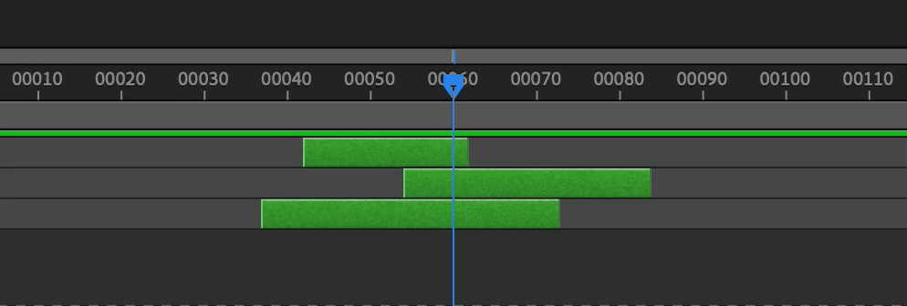

## automotion-CTI_Group_inPoint

Moves the active comp's CTI to the earliest inPoint of a group of selected layers.

## automotion-CTI_Group_outPoint

Moves the active comp's CTI to the latest outPoint of a group of selected layers.

## Replace native keyboard shortcuts

The native behaviour of the 'I' and 'O' keyboard shortcuts in After Effects is to move the CTI to the in/outPoint of the top-most layer. You can use these scripts to change this behaviour. Place them into the After Effects 'Scripts' folder, and you can then assign the 'I' and 'O' keyboard shortcuts to them.

